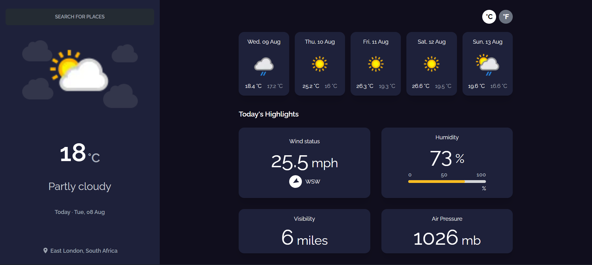
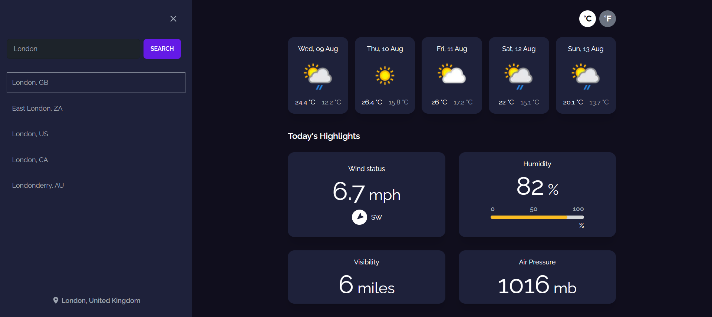

<!-- Please update value in the {}  -->

<h1 align="center">Weather App</h1>

<h3 align="center">
    <a href="https://weather-app-prasannakarki77.vercel.app/">
      Demo
    </a>  
 
</h3>

 React | Next JS | Tailwind CSS

<!-- TABLE OF CONTENTS -->

## Overview

## Features

- Search for city location
- Current weather information (temperature, wind, humidity, visibility, pressure)
- Weather forecast for next 5 days
- Weather condition icons, wind direction and humidity indicators.
- Toggle bettween temperature format of Celsius and Farenheit

## APIs

- [Amadeus](https://developers.amadeus.com/self-service/category/destination-experiences/api-doc/city-search) - City search
- [WeatherAPI](https://www.weatherapi.com/) - Current weather and Forecast for next 5 days
